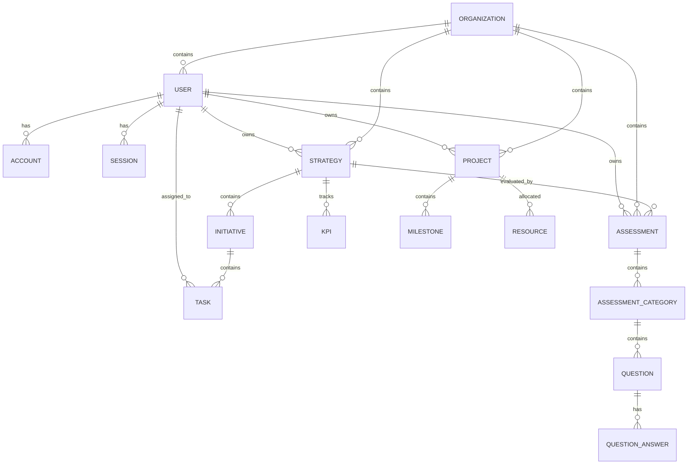

# Database Schema

This document describes the database schema for the Stratego Platform.

## Overview

The database schema is designed to support all core features of the platform:
- User authentication and management
- Organizations and team structures
- Strategic planning and execution
- Maturity assessments
- PMO services
- Training and consultation

## Entity Relationship Diagram

## Core Entities

### User
Represents a user of the platform.

**Fields:**
- `id` (String, Primary Key): Unique identifier
- `name` (String, Optional): User's full name
- `email` (String, Unique): User's email address
- `emailVerified` (DateTime, Optional): Email verification timestamp
- `image` (String, Optional): URL to user's profile image
- `role` (String): User role (user, admin, etc.)
- `createdAt` (DateTime): Creation timestamp
- `updatedAt` (DateTime): Last update timestamp

### Organization
Represents a company or organization using the platform.

**Fields:**
- `id` (String, Primary Key): Unique identifier
- `name` (String): Organization name
- `slug` (String, Unique): URL-friendly identifier
- `description` (String, Optional): Organization description
- `createdAt` (DateTime): Creation timestamp
- `updatedAt` (DateTime): Last update timestamp

### Strategy
Represents a strategic plan or initiative.

**Fields:**
- `id` (String, Primary Key): Unique identifier
- `title` (String): Strategy title
- `description` (String, Optional): Strategy description
- `status` (String): Current status (draft, active, completed, etc.)
- `startDate` (DateTime, Optional): Strategy start date
- `endDate` (DateTime, Optional): Strategy end date
- `ownerId` (String, Foreign Key): Reference to User
- `organizationId` (String, Foreign Key): Reference to Organization
- `createdAt` (DateTime): Creation timestamp
- `updatedAt` (DateTime): Last update timestamp

### Initiative
Represents a strategic initiative within a strategy.

**Fields:**
- `id` (String, Primary Key): Unique identifier
- `title` (String): Initiative title
- `description` (String, Optional): Initiative description
- `status` (String): Current status
- `priority` (Int): Priority level (1-5)
- `startDate` (DateTime, Optional): Initiative start date
- `endDate` (DateTime, Optional): Initiative end date
- `strategyId` (String, Foreign Key): Reference to Strategy
- `createdAt` (DateTime): Creation timestamp
- `updatedAt` (DateTime): Last update timestamp

### Assessment
Represents a maturity assessment or evaluation.

**Fields:**
- `id` (String, Primary Key): Unique identifier
- `title` (String): Assessment title
- `description` (String, Optional): Assessment description
- `type` (String): Assessment type (maturity, quadrant, etc.)
- `score` (Float, Optional): Overall assessment score
- `status` (String): Current status
- `ownerId` (String, Foreign Key): Reference to User
- `organizationId` (String, Foreign Key): Reference to Organization
- `strategyId` (String, Foreign Key, Optional): Reference to Strategy
- `createdAt` (DateTime): Creation timestamp
- `updatedAt` (DateTime): Last update timestamp

### Project
Represents a project managed through PMO services.

**Fields:**
- `id` (String, Primary Key): Unique identifier
- `name` (String): Project name
- `description` (String, Optional): Project description
- `status` (String): Current status
- `startDate` (DateTime, Optional): Project start date
- `endDate` (DateTime, Optional): Project end date
- `ownerId` (String, Foreign Key): Reference to User
- `organizationId` (String, Foreign Key): Reference to Organization
- `createdAt` (DateTime): Creation timestamp
- `updatedAt` (DateTime): Last update timestamp

## Authentication Entities

### Account
Stores OAuth account information for users.

### Session
Manages user sessions for authentication.

### VerificationToken
Handles email verification tokens.

## Assessment Entities

### AssessmentCategory
Represents a category within an assessment.

### Question
Represents a question within an assessment category.

### QuestionAnswer
Represents possible answers to assessment questions.

## PMO Entities

### Milestone
Represents key milestones within a project.

### Resource
Represents resources allocated to a project.